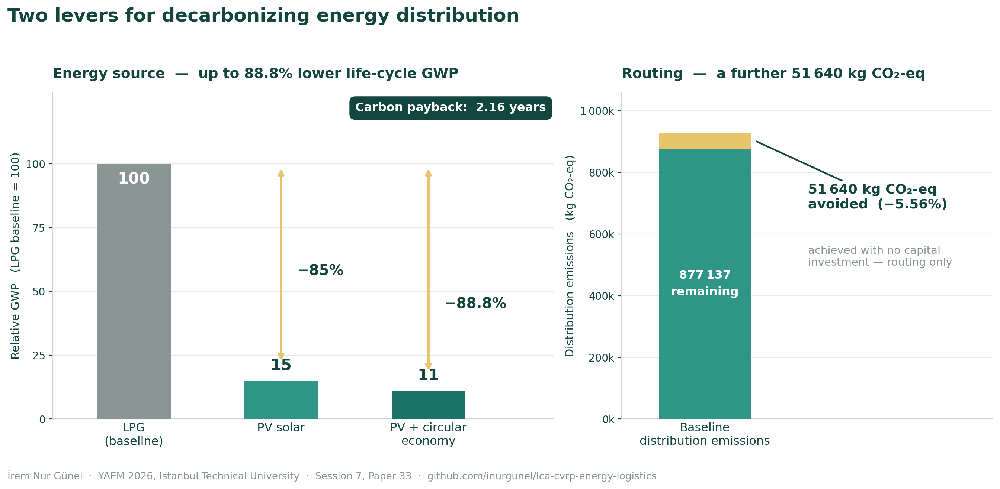

# LCA + CVRP for Energy Distribution Logistics

**Comparing LPG and photovoltaic solar supply systems across 885 dealers and 13 facilities, by combining life-cycle assessment with capacitated vehicle routing optimization.**

Presented at YAEM 2026 (Yöneylem Araştırması ve Endüstri Mühendisliği Ulusal Kongresi), Istanbul Technical University — Session 7, Paper 33.



---

## Problem

Decarbonization studies in energy distribution usually stop at the product. They compare the emissions of one fuel against another and declare a winner. But a distribution network is not only a product, it is also a set of vehicle movements, and those movements carry emissions of their own.

Two questions are therefore usually answered separately, and answering them separately gives an incomplete picture:

1. **Product question.** If a dealer network switches from LPG supply to photovoltaic solar, how much greenhouse gas emission is actually avoided across the full life cycle, including the manufacturing burden of the panels themselves?
2. **Logistics question.** How much additional reduction does routing optimization deliver, independently of any technology change?

This study answers both within one framework, so that technology substitution and operational optimization can be compared on the same unit: kilograms of CO₂-equivalent.

---

## Method

The analysis runs in two coupled stages.

**Stage 1 — Life-cycle assessment.** Modelled according to ISO 14040 and ISO 14044 across a **cradle-to-grave** system boundary, following the four standard phases: goal and scope definition, inventory analysis, impact assessment, and interpretation. Inventory data is drawn from **Ecoinvent 3.9, NREL, and IPCC 2006**. Impact assessment uses the **ReCiPe 2016** midpoint method, focused on global warming potential in kg CO₂-eq.

Three scenarios are modelled:

| Scenario | Description |
|---|---|
| Baseline | LPG-based supply system |
| PV solar | Photovoltaic solar substitution |
| PV + circular economy | PV with circular end-of-life treatment modelled as a variant |

**Stage 2 — Capacitated vehicle routing.** The distribution network of 885 dealers served from 13 facilities is modelled as a capacitated vehicle routing problem and solved with Google OR-Tools, using `PATH_CHEAPEST_ARC` for the initial solution and `GUIDED_LOCAL_SEARCH` for improvement. Distances are computed as haversine distance scaled by a 1.35 road circuity factor, under a vehicle capacity constraint. Distance savings are then converted into kg CO₂-eq.

The reason for coupling the two stages, rather than reporting them side by side, is that routing decisions change the transport inventory that the LCA consumes. Treating them independently either double counts or ignores the interaction.

---

## Results

| Finding | Value |
|---|---|
| GWP reduction, PV solar vs LPG baseline | **~85%** |
| GWP reduction, PV + circular economy variant | **~88.8%** |
| Carbon payback period of the PV system (CPBT) | **2.16 years** |
| Emissions avoided through routing optimization | **51,640 kg CO₂-eq** |
| Reduction in total distribution emissions from routing | **5.56%** |

The headline finding is the relationship between the two levers. Technology substitution dominates, as expected, and the circular economy variant pushes the reduction further still. But routing optimization removes an additional 51,640 kg CO₂-eq at no capital cost and independently of any technology change, which matters in a sector where single-digit efficiency gains are normally bought with equipment investment.

---

## Limitations

Stated plainly, because they bound what the numbers mean.

- **Geographic scope.** The dealer network is Turkish. Grid carbon intensity, solar irradiance and road network density all vary by country, so the payback period in particular does not transfer directly to other markets.
- **Static demand.** Dealer demand is treated as fixed and deterministic. Real demand is seasonal, and seasonality interacts with both routing and PV yield.
- **Single-period routing.** The CVRP formulation optimizes a representative period rather than a rolling horizon. A multi-period or stochastic formulation would likely reduce the routing saving somewhat.
- **Distance approximation.** Road distances are approximated as haversine distance scaled by a fixed 1.35 circuity factor rather than taken from a road network graph. The factor is an average and will be optimistic in mountainous regions and pessimistic on motorway corridors.
- **Background data vintage.** Ecoinvent 3.9 background processes lag current grid mixes. As grids decarbonize, the relative advantage of the PV pathway narrows.
- **Circular economy scenario.** The circular variant is modelled with generic recovery assumptions rather than measured recycling rates for a specific Turkish waste stream, so the 88.8% figure should be read as an upper bound rather than a forecast.

---

## Repository contents

```
.
├── src/
│   ├── config.py                   Model parameters in one place
│   ├── generate_synthetic_data.py  Builds the synthetic network
│   ├── lca_model.py                ReCiPe 2016 GWP calculation and payback
│   └── cvrp_solver.py              OR-Tools capacitated routing
├── data/
│   ├── README.md                   Data provenance and anonymization notice
│   ├── synthetic_dealers.csv       Generated, not real
│   └── synthetic_facilities.csv    Generated, not real
├── notebooks/
│   └── analysis.ipynb              End-to-end walkthrough
├── figures/
│   └── lca-cvrp-results.png        Results summary
└── docs/                           Presentation slides
```

---

## Data notice

**The data in this repository is synthetic.** The case study behind the paper used a distribution network whose underlying operational data is not redistributable. The generator in `src/generate_synthetic_data.py` produces a network with the same structure and comparable statistical properties — 885 dealers, 13 facilities, similar spatial dispersion and demand distribution — but no real locations, names or volumes.

The pipeline is therefore fully reproducible; the published figures above are not. Running this code will produce internally consistent results for the synthetic network, which will differ from the values reported in the paper. That is intentional. What is being shared here is the method, not the dataset.

---

## Reproducing the pipeline

```bash
git clone https://github.com/inurgunel/lca-cvrp-energy-logistics.git
cd lca-cvrp-energy-logistics
pip install -r requirements.txt

python src/generate_synthetic_data.py     # builds the synthetic network
python src/cvrp_solver.py                 # solves baseline and optimized routing
python src/lca_model.py                   # computes GWP and carbon payback
```

Tested on Python 3.11.

---

## Citation

```
Günel, İ. N., & Akıf, B. (2026). Life cycle assessment of LPG and photovoltaic
solar energy systems: logistics emission optimization with the capacitated
vehicle routing problem. YAEM 2026 — National Congress on Operations Research
and Industrial Engineering, Istanbul Technical University, Session 7, Paper 33.
```

---

## License

Code released under the MIT License. See [LICENSE](LICENSE).
